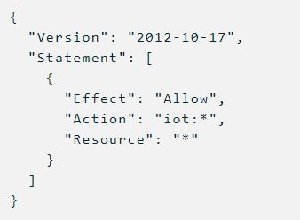
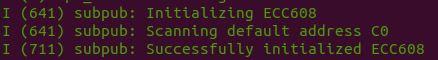

# ESP32 AWS IoT with ATECC608A

This project is a fork of esp-aws-iot from Espressif, and it contain several modifications including support of ESP-IDF versions release/v4.2 and release/v4.3. Also, there is native support for ATECC608A TrustCustom, while other chip types (Trust&Go, TrustFlex) are not currently supported.

## About This Project

This project contains a single application for the ESP32, "subscribe-publish", which can be found in the "examples" directory. This example will connect to AWS IoT, authenticate using a private key stored in the ATECC608A, and communicate using MQTT.

## Changes from espressif/esp-aws-iot

This project makes the following changes to [espressif/esp-aws-iot](https://github.com/espressif/esp-aws-iot):

- The "subscribe-publish" example now supports ATECC608A by default. Several changes were made to `examples/subscribe_publish/main/subscribe_publish_sample.c` including a new `initialize_ecc608()` function, and minor changes to `aws_iot_task()` for using the device private key stored in the ECC608.
- The `esp-cryptoauthlib` component was updated to support scanning of the I2C address (in case the user does not know it).
- The default I2C pins were changed to 27 (SDA) and 33 (SCL).
- The "thing_shadow" example was removed, although it may be added back later.

## Getting Started

- Installation instructions for ESP-IDF version release/v4.2 are here: https://docs.espressif.com/projects/esp-idf/en/release-v4.2/esp32/get-started/index.html

- Please clone this repository using the following command:
    ```sh
    git clone --recursive https://github.com/PBearson/esp-aws-iot
    ```
    **Note**: By default, this project is already located in the ``` ~/esp/IoT-Examples/ ``` directory of the Ubuntu VM.

## Provision the ATECC608A

Before you can run the "subscribe-publish" example, you need to provision the ECC608 that is attached to your ESP32 via the I2C protocol. If you have not done so already, please download the [Provision-ECC608](https://github.com/PBearson/Provision-ECC608) project, which will generate a private key in the crypto chip and provide you with a CSR. **Please make sure to save this CSR to a file.**

## AWS IoT

After you have provisioned the ECC608 and saved your CSR to a file, open your AWS IoT console. There you will upload the CSR by going to Secure -> Certificates -> Create -> Create with CSR. AWS will sign the CSR and provide you with a valid device certificate. Download the certificate, and make sure to activate it in the console. You also need to attach a valid IoT policy to your certificate. A sample policy is shown below, which grants full IoT access to authorized devices:



## Configure the Project

1. Navigate to the "subscribe-publish" directory:
    ```sh
        cd esp-aws-iot/examples/subscribe_publish
    ```
2. Place the downloaded device certificate to the "main/certs" directory. Rename the certificate file to "certificate.pem.crt".

3. Now open the menu config with the following command:

    ```sh
        idf.py menuconfig
    ```
    You must configure the following settings to successfully connect your device to AWS IoT:
    - Example Configuration -> WiFi SSID
    - Example Configuration -> WiFi Password
    - Component config -> esp-cryptoauthlib -> Enable Hardware ECDSA keys for mbedTLS
    - Component config -> esp-cryptoauthlib -> Enable ATECC608A sign operations in mbedTLS
    - Component config -> esp-cryptoauthlib -> Enable ATECC608A verify operations in mbedTLS
    - Component config -> esp-cryptoauthlib -> I2C SDA pin used to communicate with the ATECC608A
    - Component config -> esp-cryptoauthlib -> I2C SCL pin used to communicate with the ATECC608A
    - (OPTIONAL) Component config -> esp-cryptoauthlib -> Scan for ATECC608A I2C
    - Component config -> Amazon Web Services IoT Platform -> AWS IoT Endpoint Hostname
    - Component config -> Amazon Web Services IoT Platform -> Use the hardware secure element for authenticating TLS connections

    The AWS IoT endpoint can be obtained in the AWS IoT console on the "settings" page.

    If "Scan for ATECC608A I2C" is not selected, then the application will try to use address 0xC0 by default.
3. Install the jsmn component using the following command.
```
 idf.py add-dependency "espressif/jsmn^1.1.0"
```


## Build and Run
1. Before building the command ensure the necessary components are included, run the following command!
    ```sh
        idf.py add-dependency "espressif/jsmn^1.1.0" 
    ```
2. To build, flash and monitor the serial output of the app, run the following command:
    ```sh
        idf.py build flash monitor
    ```

The ESP32 will attempt to connect to AWS IoT. If the procedure was followed correctly, then the ESP32 will use its device certificate and device private key (stored in slot 0 of the ECC608) to authenticate to AWS IoT.

Observe the console output carefully, as it can give important information regarding any errors that occur. The output gives indication whether the ECC608 was initialized successfully, as shown below:



Moreover, if the authentication was successful, the output will indicate that the device has subscribed to an MQTT topic and will periodically publish a message to the topic "test_topic/esp32":


